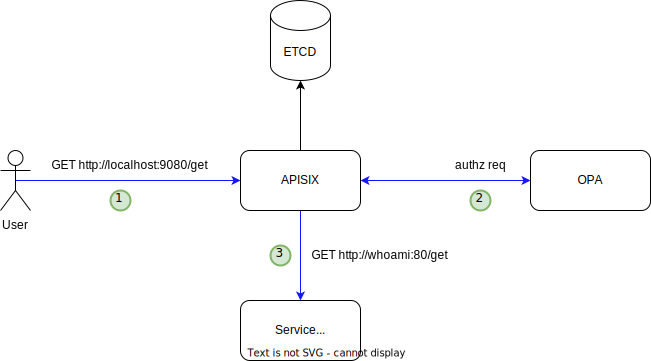

APISIX with OPA Example
--------------------------

* [Setup](#setup)
* [Test](#test)
  * [Successfully Allowed](#successfully-allowed)
  * [Fail and 302 redirect](#fail-and-302-redirect)
  * [Fail and json response](#fail-and-json-response)
* [Links](#links)

## Setup

```
docker compose up -d
```

Wait for sometime. Then

```
docker compose ps -a
```

The `apisix-init` and `opa-init` should exit with exit code 0.



## Test

Test the following success and failure cases.


### Successfully Allowed

```
curl -v -XGET http://localhost:9080/get?test=none&user=dylon --header 'test-header: only-for-test'
```

Successfully proxied to upstream.


The equivalent input for the rego is

```
{
    "request": {
        "method": "GET",
        "path": "/get",
        "query": {
            "test": "none",
            "user": "dylon"
        },
        "headers": {
            "test-header": "only-for-test"
        },
        "origin": "localhost",
        "url": "http://localhost:9080/get?test=none&user=dylon"
    }
}
```

Validate this rule and input in online playground https://play.openpolicyagent.org/p/fcC4l63dam

### Fail and 302 redirect

```
curl -v -XGET http://localhost:9080/get?test=abcd&user=alice --header 'test-header: only-for-test'
```

### Fail and json response


```
curl -v -XGET http://localhost:9080/get?test=abcd&user=dylon --header 'test-header: only-for-test'
```

## Links

https://github.com/anderseknert/awesome-opa

Rego https://www.openpolicyagent.org/docs/latest/policy-language/

Data distribution to OPA https://github.com/permitio/opal

Referred from tutorial https://medium.com/@ApacheAPISIX/apache-apisix-integrates-with-open-policy-agent-to-enrich-its-ecosystem-15569fe3ab9c
